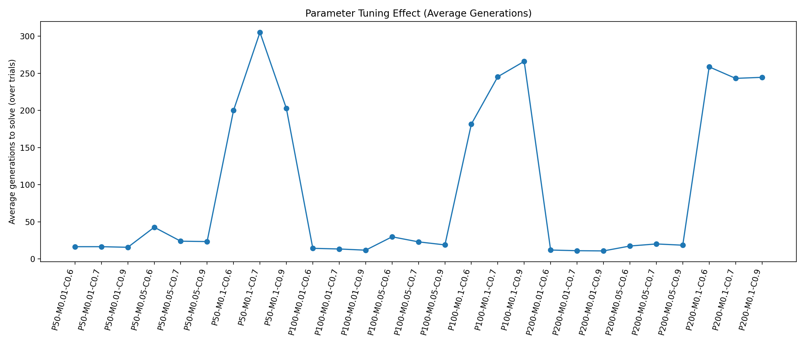
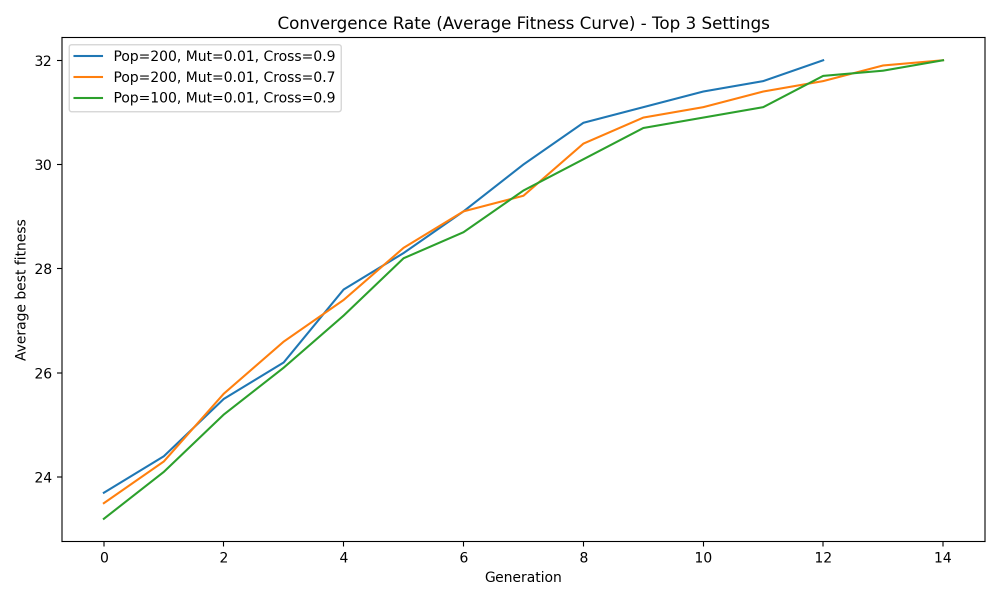
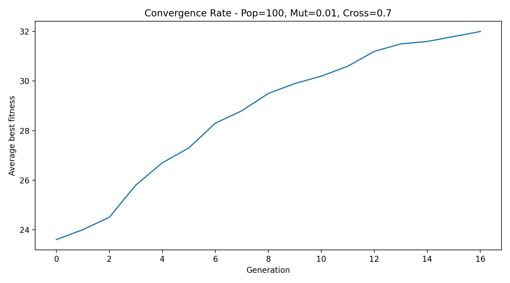

# Genetic Password Cracker

A project that uses a **Genetic Algorithm (GA)** to evolve a population of binary strings until it matches a randomly generated 32-bit binary passcode. Includes full parameter tuning across population size, mutation rate, and crossover rate.

## Authors

- **Muhammad Aljamal**
- **Tariq Ladadweh**

---

## How It Works

1. A random 32-bit binary passcode is generated as the target
2. A population of random binary strings is initialized
3. Each generation:
   - Individuals are ranked by **fitness** (number of matching bits)
   - Top 50% are selected as parents
   - **Crossover** produces new offspring
   - **Mutation** flips bits randomly
   - Elitism keeps the best individual
4. The algorithm terminates when a perfect match is found

---

## Parameters

| Parameter | Values Tested |
|-----------|---------------|
| Population Size | 50, 100, 200 |
| Mutation Rate | 0.01, 0.05, 0.1 |
| Crossover Rate | 0.6, 0.7, 0.9 |

27 combinations were tested, each run 10 times on different passcodes.

---

## Results

### Average Generations to Solve (All 27 Settings)



> Each point represents one parameter combination. Lower is better — fewer generations means the algorithm converged faster.

---

### Convergence Curves — Top 3 Fastest Settings



> Shows how the average best fitness evolves across generations for the three fastest-converging parameter settings. The fitness quickly approaches 32 (perfect match).

---

### Convergence Curves — All 27 Settings

Individual convergence plots for every parameter combination are saved in [`ga_outputs/convergence_27/`](ga_outputs/convergence_27/).

Example — `conv_P100_M0.01_C0.7.png`:



---

## Project Structure

```
genetic-password/
├── ga_project.py                        # Main GA script
├── ga_outputs/
│   ├── avg_generations.png              # Tuning effect chart
│   ├── convergence_curves_top3.png      # Top 3 settings convergence
│   ├── convergence_27/                  # 27 individual convergence plots
│   │   └── conv_P{pop}_M{mut}_C{cross}.png
│   └── runs/                            # CSV convergence data per trial
└── README.md
```

---

## How to Run

```bash
# Install dependencies
pip install matplotlib

# Run the genetic algorithm (demo + full parameter tuning)
python ga_project.py
```

---

## Requirements

- Python 3.8+
- matplotlib
